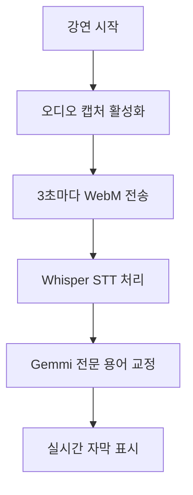

## 1. Product Overview
치과 전문 학술 강연용 실시간 자막 생성 시스템. Whisper AI를 활용해 음성을 텍스트로 변환하고, Gemini AI로 교정하여 전문 의학 용어를 정확히 표시한다.

## 2. Core Features

### 2.1 User Roles
해당 제품은 단일 사용자(강연자)를 대상으로 하며, 별도의 역할 구분이 필요하지 않습니다.

### 2.2 Feature Module
치과 강연 자막 시스템은 다음 주요 페이지로 구성됩니다:
1. **메인 페이지**: 오디오 캡처, 실시간 자막 표시, 설정 패널

### 2.3 Page Details
| Page Name | Module Name | Feature description |
|-----------|-------------|---------------------|
| 메인 페이지 | 오디오 캡처 컨트롤 | getDisplayMedia로 시스템 오디오 우선 캡처, 마이크와 믹싱 후 3초마다 WebM 파일로 서버 전송 |
| 메인 페이지 | 실시간 자막창 | 워드 프로세서형 단일 div에 텍스트 누적 표시, Whisper 원문 → Gemini 교정문 실시간 교체 |
| 메인 페이지 | 설정 패널 | 오디오 입력 장치 선택, 캡처 시작/중지 버튼, 교정 API 키 입력 |

## 3. Core Process
사용자는 강연 시작 시 오디오 캡처를 활성화한다. 시스템은 시스템 오디오와 마이크 입력을 믹싱하여 3초 단위 WebM 청크로 서버에 전송한다. 서버는 Whisper로 STT 수행 후 Gemini로 치과 전문 용어 교정을 거쳐 실시간으로 자막을 표시한다.

## 4. User Interface Design

### 4.1 Design Style
- **Primary Color**: #2563eb (의학적 신뢰감)
- **Background**: #ffffff (깔끔한 화이트)
- **Font**: Noto Sans KR, 16px 기본, 24px 자막
- **Layout**: 싱글 페이지, 상단 캡처 컨트롤, 중앙 자막창, 하단 설정
- **Button**: 둥근 모서리, 파란색 배경, 흰색 텍스트

### 4.2 Page Design Overview
| Page Name | Module Name | UI Elements |
|-----------|-------------|-------------|
| 메인 페이지 | 오디오 캡처 컨트롤 | 파란색 원형 시작/중지 버튼, 입력 장치 드롭다운, 상태 표시 LED |
| 메인 페이지 | 실시간 자막창 | 흰색 배경의 큰 div, 검은색 24px 텍스트, 자동 스크롤, 부드러운 교정 애니메이션 |
| 메인 페이지 | 설정 패널 | 접기/펼치기 가능, API 키 입력 필드, 교정 온/오프 토글 |

### 4.3 Responsiveness
Desktop-first 설계로 Chrome 기준 최적화. 1920x1080 해상도 기준 전체화면 모드에서 강연 화면과 함께 사용 가능하도록 우측 또는 하단에 배치.

### 4.4 3D Scene Guidance
해당 제품은 2D 웹 애플리케이션으로 3D 콘텐츠가 없습니다.