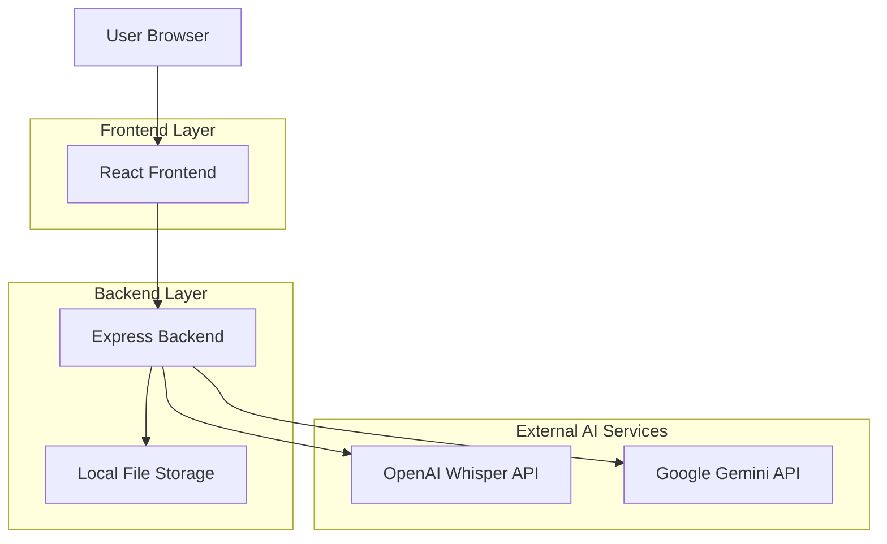
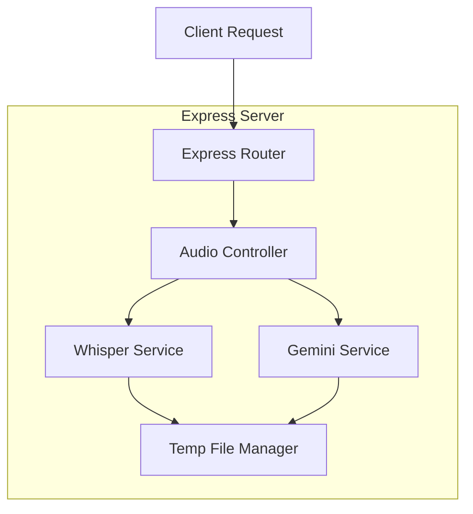

## 1. Architecture design



## 2. Technology Description
- Frontend: React@18 + TypeScript + TailwindCSS
- Initialization Tool: vite-init
- Backend: Express@4 + TypeScript
- AI Services: OpenAI Whisper API, Google Gemini API
- File Storage: Local filesystem (temp audio files)

## 3. Route definitions
| Route | Purpose |
|-------|---------|
| GET / | 메인 페이지, 자막 UI 제공 |
| POST /api/audio/upload | WebM 오디오 파일 업로드 및 STT 처리 |
| GET /api/health | 서버 상태 확인 |

## 4. API definitions

### 4.1 Audio Upload API
```
POST /api/audio/upload
```

Request:
- Content-Type: multipart/form-data
- Body: WebM audio file (3초 단위 청크)

Response:
| Param Name | Param Type | Description |
|------------|-------------|-------------|
| success | boolean | 처리 성공 여부 |
| transcript | string | Whisper STT 결과 |
| corrected | string | Gemini 교정 결과 |
| timestamp | string | 처리 시각 |

Example
```json
{
  "success": true,
  "transcript": "임플란트 수술 시 상악동 거상술이 필요한 경우...",
  "corrected": "임플란트 수술 시 상악동 거상술(Sinus Graft)이 필요한 경우...",
  "timestamp": "2026-01-09T10:30:00Z"
}
```

## 5. Server architecture diagram



## 6. Data model
해당 시스템은 영구 데이터 저장소를 사용하지 않으며, 3초 단위 오디오 청크는 임시 파일로 처리 후 즉시 삭제됩니다.

### 6.1 Temporary File Structure
```
/tmp/audio/
├── session-{uuid}/
│   ├── chunk-001.webm
│   ├── chunk-002.webm
│   └── ... (자동 삭제)
```

### 6.2 API Key Management
환경 변수로 관리:
```bash
OPENAI_API_KEY=sk-...
GEMINI_API_KEY=...
```