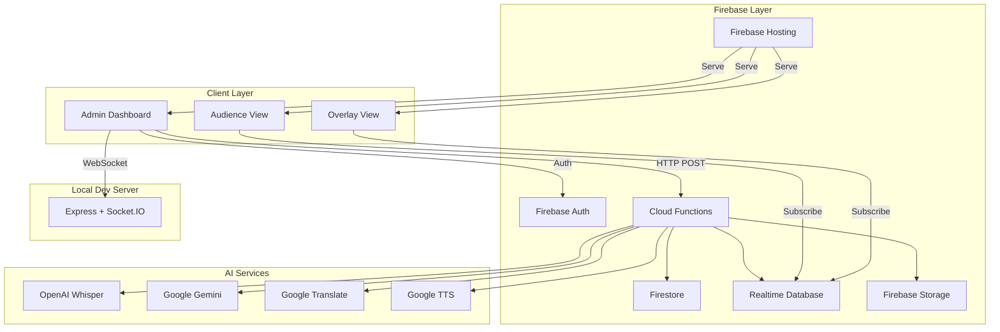
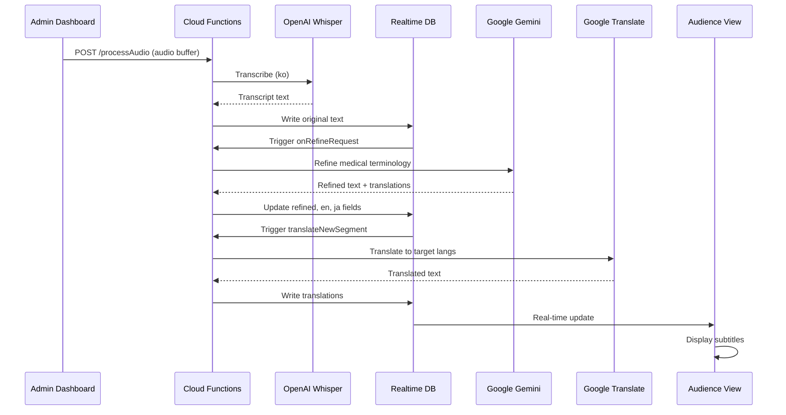

# System Architecture

Complete architectural overview of the Translation platform - a real-time medical conference translation system.

## Table of Contents

- [Overview](#overview)
- [System Architecture](#system-architecture)
- [Module Breakdown](#module-breakdown)
- [Data Flow](#data-flow)
- [Technology Stack](#technology-stack)
- [Database Schema](#database-schema)
- [Security Model](#security-model)

## Overview

The Translation platform is an event-driven, real-time system that processes audio streams through an AI pipeline:

1. **Audio Capture** - Client captures audio (microphone/system audio) in 3-second chunks
2. **Speech-to-Text** - OpenAI Whisper transcribes audio to text
3. **Text Refinement** - Google Gemini corrects medical terminology and improves readability
4. **Translation** - Google Cloud Translate produces multi-language outputs
5. **Real-time Display** - Firebase Realtime Database syncs to audience clients

## System Architecture



## Module Breakdown

### Client (`client/`)

React + Vite frontend for administrators and audience.

**Key Components:**
- `App.tsx` - Router with protected admin routes
- `components/AdminDashboard.tsx` - Conference/session management, audio capture controls
- `components/AudienceView.tsx` - Live subtitle display for audience
- `components/OverlayView.tsx` - OBS-compatible caption overlay
- `components/Login.tsx` - Firebase Auth login
- `hooks/useProjectStream.ts` - Realtime Database subscription hook

**Entry Point:** `client/src/main.tsx`

**Tech Stack:**
- React 19.2.0 + TypeScript
- Vite (dev server, HMR)
- TailwindCSS
- Firebase JS SDK v12.7.0
- React Router 7.11.0
- date-fns 4.1.0

### Cloud Functions (`functions/`)

Firebase Functions v2 (Node.js 20) backend orchestrating the AI pipeline.

**Key Functions:**
- `processAudio` (HTTP) - Receives audio buffers, runs Whisper STT
- `onRefineRequest` (Database trigger) - Refines transcriptions with Gemini
- `translateNewSegment` (Database trigger) - Translates to target languages
- `archiveSession` (HTTP) - Archives transcripts and resets session state
- `purgeSession` (HTTP) - Admin utility to purge session data
- `triggerRemaster` (Pub/Sub) - Batch reprocessing of transcripts

**Entry Point:** `functions/src/index.ts`

**Tech Stack:**
- Firebase Functions (v2)
- Node.js 20 runtime
- OpenAI SDK (Whisper)
- Google Gemini REST API
- @google-cloud/translate
- Firebase Admin SDK

### Server (`server/`)

Express + Socket.IO local development server for testing streaming without cloud dependencies.

**Key Features:**
- Socket.IO event handling (`audio_stream`, `partial_result`, `final_result`)
- Whisper STT integration (same as cloud)
- Placeholder Gemini refinement
- Emulates cloud flow for local testing

**Entry Point:** `server/src/index.ts`

**Tech Stack:**
- Express 5.x
- Socket.IO 4.x
- TypeScript
- ts-node (dev)
- nodemon (dev)

### Firebase Services

| Service | Purpose | Path/Collection |
|---------|---------|-----------------|
| **Firestore** | Project settings, metadata | `projects/{projectId}/settings` |
| **Realtime DB** | Live transcripts, session state | `projects/{projectId}/stream`, `sessions` |
| **Cloud Functions** | Serverless backend logic | HTTP endpoints, DB triggers |
| **Firebase Auth** | User authentication | Email/password |
| **Firebase Storage** | Audio assets, TTS outputs | `audios/{projectId}/{sessionId}/{seq}.mp3` |
| **Firebase Hosting** | Frontend SPA | `client/dist` |

## Data Flow

### Complete Audio Pipeline



### Step-by-Step Breakdown

1. **Audio Capture**
   - Admin Dashboard captures audio via `getDisplayMedia()` (system audio) or microphone
   - Audio is chunked into 3-second segments
   - Chunks are sent via HTTP POST to Cloud Function `processAudio`

2. **Speech-to-Text (Whisper)**
   - `processAudio` receives raw audio buffer
   - Converts to temporary WAV/WEBM file in `/tmp/audio`
   - Calls OpenAI Whisper API with:
     - Model: `whisper-1`
     - Language: Auto-detected (or `ko` for Korean)
     - Prompt: Medical context guidance
   - Result stored in RTDB: `projects/{projectId}/stream/{segmentId}`

3. **Text Refinement (Gemini)**
   - RTDB trigger `onRefineRequest` fires on new stream entries
   - Builds prompt with:
     - Original transcript
     - Medical context (dental conference)
     - Target languages (en, ja)
   - Calls Gemini REST API (FLASH or PRO model)
   - Receives structured JSON:
     ```json
     {
       "refined": "corrected medical terminology",
       "translations": {
         "en": "English translation",
         "ja": "Japanese translation"
       },
       "isMedicalContext": true
     }
     ```
   - Updates RTDB with refined text and translations

4. **Multi-language Translation**
   - RTDB trigger `translateNewSegment` fires on refined updates
   - Fetches project settings from Firestore: `targetLangs`
   - Translates refined text to each target language
   - Writes to RTDB: `stream/{segmentId}/{targetLang}`

5. **Real-time Display**
   - Audience View and Overlay View subscribe to RTDB via `useProjectStream` hook
   - Receive real-time updates on new segments
   - Display text with language toggle (original, refined, en, ja, etc.)

## Technology Stack

### Frontend

| Technology | Version | Purpose |
|------------|---------|---------|
| React | 19.2.0 | UI framework |
| TypeScript | 5.x | Type safety |
| Vite | Latest | Build tool & dev server |
| TailwindCSS | Latest | Styling |
| Firebase JS SDK | 12.7.0 | Firebase integration |
| React Router | 7.11.0 | Client routing |
| Socket.IO Client | 4.8.3 | WebSocket (dev only) |
| date-fns | 4.1.0 | Date utilities |

### Backend

| Technology | Version | Purpose |
|------------|---------|---------|
| Express | 5.x | HTTP server (local dev) |
| Socket.IO | 4.x | WebSocket (local dev) |
| Firebase Functions | v2 | Serverless backend |
| Node.js | 20 | Runtime |
| OpenAI SDK | Latest | Whisper STT |
| Google Gemini | REST API | Text refinement |
| @google-cloud/translate | Latest | Translation |
| Firebase Admin SDK | Latest | Firebase backend access |

### Firebase Services

| Service | Usage |
|---------|-------|
| Firestore | Project settings, configuration |
| Realtime Database | Live transcripts, session state |
| Cloud Functions | AI pipeline orchestration |
| Firebase Auth | User authentication |
| Firebase Storage | Audio files, TTS outputs |
| Firebase Hosting | Frontend hosting |

## Database Schema

### Firestore Structure

```
projects/{projectId}
├── settings
│   ├── targetLangs: ["en", "ja", "zh"]
│   ├── overlay
│   │   ├── fontSize: 24
│   │   ├── fontColor: "#000000"
│   │   ├── bgColor: "#ffffff"
│   │   └── alignment: "left"
│   └── chunk
│       ├── minLength: 1000
│       ├── timeoutMs: 3000
│       └── sentenceEnd: true
└── sessions/{sessionId}
    ├── speaker: string
    ├── topic: string
    ├── language: string
    ├── startTime: timestamp
    └── transcript: reference
```

### Realtime Database Structure

```
projects/{projectId}
├── stream
│   ├── {segmentId}
│   │   ├── id: string
│   │   ├── original: string (Whisper output)
│   │   ├── refined: string (Gemini output)
│   │   ├── en: { text, timestamp, isFinal }
│   │   ├── ja: { text, timestamp, isFinal }
│   │   ├── status: "partial" | "final"
│   │   ├── timestamp: ISO string
│   │   ├── sessionId: string
│   │   ├── seq: number
│   │   ├── mergedIds: string[]
│   │   └── audioUrl: string (TTS)
│   └── ...
├── sessions
│   └── {sessionId}
│       ├── speaker: string
│       ├── topic: string
│       ├── language: string
│       ├── startTime: timestamp
│       └── settings: object
├── activeSessionId: string
└── settings
    ├── overlay: { fontSize, fontColor, ... }
    └── chunk: { minLength, timeoutMs, ... }
```

## Security Model

### Authentication

- **Firebase Auth** (Email/Password)
- Admin routes protected: `Login.tsx` → `AdminDashboard.tsx`
- Cloud Functions verify Firebase ID tokens via `admin.auth().verifyIdToken()`

### Authorization

| Endpoint/Trigger | Auth Required | Access Control |
|------------------|---------------|----------------|
| `processAudio` | Firebase ID Token | Project members |
| `archiveSession` | Firebase ID Token | Admin only |
| `purgeSession` | Firebase ID Token | Admin only |
| `triggerRemaster` | Firebase ID Token | Admin only |
| RTDB Streams | Public read | Authenticated write |
| Firestore Settings | Authenticated read/write | Project members |

### Security Rules

**Realtime Database (`database.rules.json`):**
```json
{
  "rules": {
    "projects": {
      "$projectId": {
        ".read": "auth != null",
        ".write": "auth != null",
        "stream": {
          ".indexOn": ["timestamp", "sessionId"]
        }
      }
    }
  }
}
```

**Firestore (`firestore.rules`):**
- Public read for project metadata
- Authenticated write for settings
- Admin-only for sensitive operations

### API Key Management

- **Development**: `functions/.env` (gitignored)
- **Production**: Firebase Functions config or Secret Manager
- **Keys Required**:
  - `OPENAI_API_KEY` - Whisper STT
  - `GEMINI_API_KEY` - Text refinement
  - `GOOGLE_TTS_API_KEY` - Text-to-speech
  - `GOOGLE_API_KEY` - Cloud Translate

## Deployment Architecture

### Hosting

- **Platform**: Firebase Hosting
- **Source**: `client/dist` (Vite build output)
- **Configuration**: `firebase.json`
- **SPA Rewrites**: All routes → `index.html`

### Cloud Functions

- **Runtime**: Node.js 20
- **Region**: Default (us-central1)
- **Functions**: `processAudio`, `archiveSession`, `purgeSession`, `triggerRemaster`
- **Triggers**: HTTP, RTDB `onWrite`, Pub/Sub

### Local Development

- **Client**: Vite dev server (`localhost:5173`)
- **Server**: Express + Socket.IO (`localhost:3000`)
- **Emulators**: Firebase emulators (`firebase emulators:start`)

## Performance Considerations

### Real-time Latency

- Audio chunking: 3 seconds
- Whisper STT: ~1-2 seconds per chunk
- Gemini refinement: ~500ms - 1 second
- Translation: ~200-500ms per language
- **Total end-to-end**: ~5-7 seconds

### Scaling

- **Cloud Functions**: Auto-scales with load
- **Realtime DB**: Handles 10K+ concurrent connections
- **Whisper API**: Rate-limited by OpenAI tier
- **Gemini API**: Rate-limited by Google quota

### Optimization Strategies

1. **Batch Processing**: Remaster function aggregates segments
2. **Caching**: RTDB subscriptions minimize redundant reads
3. **Lazy Loading**: Overlay View only loads recent segments
4. **Audio Compression**: WebM format reduces bandwidth

## Monitoring & Debugging

### Cloud Functions Logging

```javascript
functions.logger.info("Processing audio", { projectId, sessionId });
functions.logger.error("Whisper API error", { error });
```

### Client-Side Debugging

```javascript
// RTDB subscription errors
onValue(ref, (snapshot) => {}, (error) => {
  console.error("RTDB error:", error);
});
```

### Common Issues

| Issue | Cause | Solution |
|-------|-------|----------|
| Stale transcripts | RTDB trigger missed | Manually trigger remaster |
| Audio not processing | Whisper API timeout | Check API quota, reduce chunk size |
| Translation missing | Firestore settings empty | Set `targetLangs` in project settings |
| Auth errors | Token expired | Re-login, verify Firebase Auth config |

---

**Related Documentation:**
- [DEVELOPMENT.md](DEVELOPMENT.md) - Development setup and workflow
- [API.md](API.md) - API endpoints and data schemas
- [DEPLOYMENT.md](DEPLOYMENT.md) - Deployment guide
